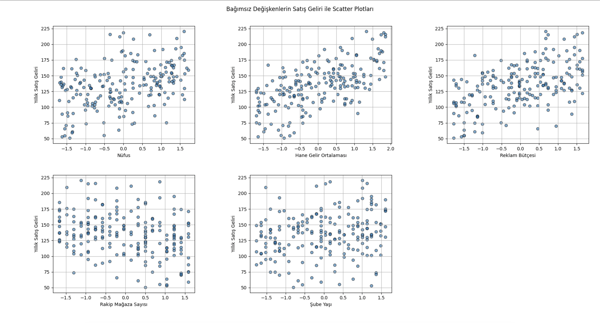
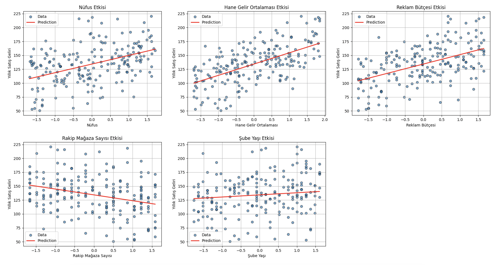
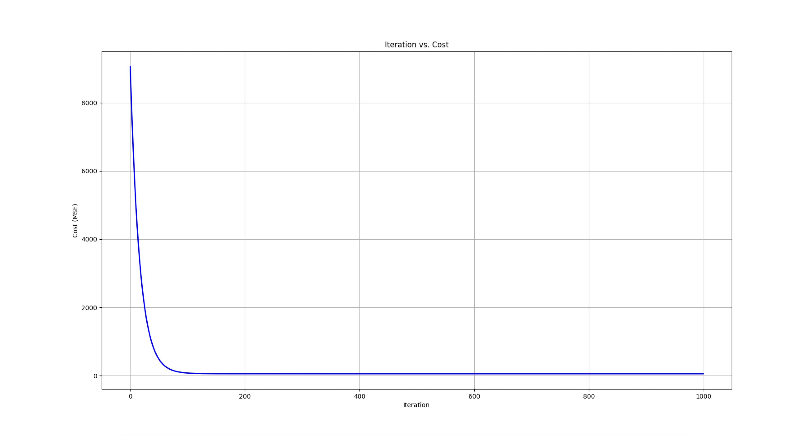

# **Yıllık Satış Geliri Tahmini Projesi**

Bu proje, bir mağazanın yıllık satış gelirini tahmin etmek için çoklu doğrusal regresyon modelini kullanmayı amaçlar. Proje kapsamında sentetik bir veri seti oluşturulmuş ve bu veri üzerinde gradient descent algoritması ile model eğitilmiştir. Ayrıca sonuçların görselleştirilmesi ve model performansının analiz edilmesi sağlanmıştır.

---

## **Proje Özeti**

Bir mağazanın yıllık satış gelirini tahmin etmek için kullanılan bağımsız değişkenler şunlardır:

- **Nüfus (Population):** Mağazanın bulunduğu şehrin ortalama nüfusu (örneğin bin kişi cinsinden).
- **Hane Gelir Ortalaması (Average Household Income):** Şehirdeki hane başına ortalama yıllık gelir (bin TL cinsinden).
- **Reklam Bütçesi (Advertising Budget):** Mağazanın yıllık reklam bütçesi (bin TL cinsinden).
- **Rakip Mağaza Sayısı (Number of Competitors):** Aynı şehirdeki (veya yakın civardaki) rakip mağaza sayısı.
- **Şube Yaşı (Store Age):** Şubenin faaliyete geçmesinden bu yana geçen süre (yıl cinsinden).

Proje kapsamında:

1. Sentetik bir veri seti oluşturulmuştur.
2. Gradient descent algoritması kullanılarak model eğitilmiştir.
3. Modelin sonuçları görselleştirilmiş ve performansı analiz edilmiştir.

---

## **Kullanılan Teknolojiler**

- **Python 3.8+**
- **Numpy:** Veri manipülasyonu ve hesaplama.
- **Matplotlib:** Görselleştirme.
- **Gradient Descent Algoritması:** Parametre optimizasyonu için.

---

## **Projenin Amaçları**

1. Çoklu doğrusal regresyon modeli kurarak, yıllık satış gelirini tahmin etmek.
2. Gradient descent algoritmasının çalışma prensibini uygulamalı olarak göstermek.
3. Modelin performansını analiz ederek geliştirme alanlarını belirlemek.

---

## **Projenin Yapısı**

- **Veri Oluşturma:** Sentetik bir veri seti rastgele sayılar kullanılarak oluşturulmuştur. Her bir özellik (feature) belirli bir aralıkta rastgele seçilmiş ve gerçek modele (ground truth) dayalı bir hedef değişken (\(Y\)) eklenmiştir.
  
- **Model Eğitimi:**  
  Gradient descent algoritması, Mean Squared Error (MSE) kayıp fonksiyonu minimize edilerek parametrelerin (\(w\) ve \(b\)) öğrenilmesi için kullanılmıştır.

- **Performans Analizi ve Görselleştirme:**  
  Eğitim sonunda modelin tahmin fonksiyonları scatter plot'lar üzerinde görselleştirilmiş ve her bir özelliğin tahmin üzerindeki etkisi analiz edilmiştir.

---

## **Çıktılar**
   - İterasyon başına maliyet fonksiyonunun değeri.
   - Özellikler ile hedef değişkenin scatter plot'ları ve tahmin fonksiyonları.
   - Modelin tahmin ettiği ağırlıklar (\(w\)) ve bias (\(b\)).

---

### **Elde Edilen Grafikler**

Her bir özelliğin (örneğin "Nüfus") tahmin fonksiyonu scatter plot üzerinde gösterilmiştir. Aşağıdaki grafiklerde modelin doğruluğunu analiz edebilirsiniz:

1. Özelliklerin scatter plot'u ve tahmin fonksiyonları:
   

3. İterasyon–Maliyet Grafiği:
   

---

